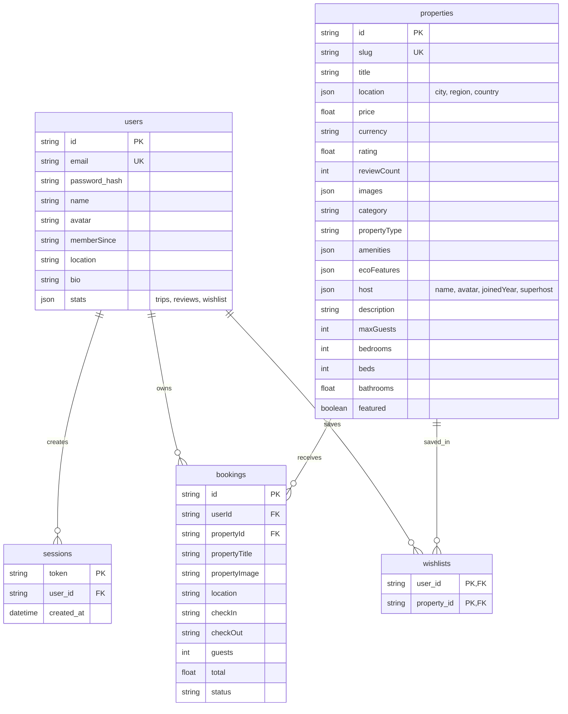
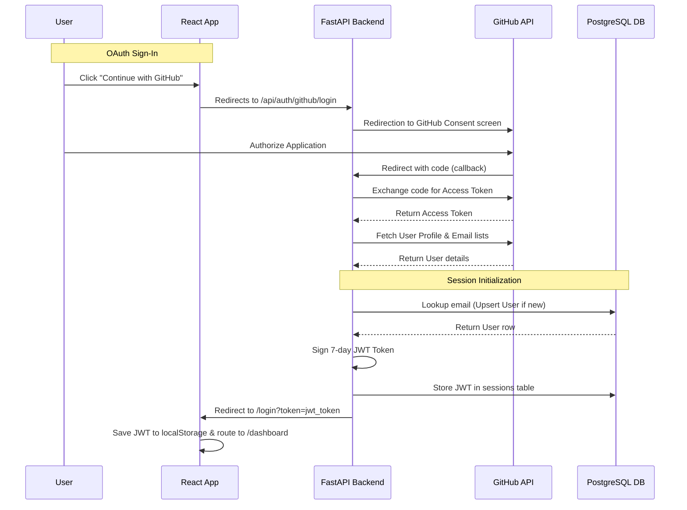

# EcoStay – AI Assisted Homestay Booking Platform 🌿🏡

[](https://react.dev/)
[](https://fastapi.tiangolo.com/)
[](https://www.postgresql.org/)
[](https://supabase.com/)
[](https://jwt.io/)
[](https://github.com/)
[](https://tailwindcss.com/)
[](https://www.python.org/)

EcoStay is a premium, full-stack eco-tourism booking platform designed exclusively for discovering and reserving sustainable homestays, cottages, and cabins across major tourist destinations in India. Built with a React/Vite frontend and a PostgreSQL-backed FastAPI backend, this project incorporates modern software engineering practices, robust database schemas, secure authentication, rate-limiting, and standard GitHub OAuth login integrations.

This repository represents the completed deliverables through **Week 6** of the development timeline.

---

## 🚀 Key Features

### Frontend 💻
*   **Responsive Premium UI**: Glassmorphic styling, animations, and typography tailored for an immersive desktop/mobile user experience.
*   **Property Listings & Details**: Browsing 62 curated stays across 31 Indian cities, with structural category filters (cabins, villas, camps, homestays).
*   **Advanced Search**: Instantly query properties matching title, category, city, region, or description.
*   **Interactive Booking & Reservation**: Calculates rates based on stay nights, guest caps, and triggers Razorpay payment order verifications.
*   **Dynamic User Dashboard**: Seamlessly track trip counts, cancel upcoming reservations, view saved wishlists, and manage profile account details.

### Backend ⚙️
*   **FastAPI REST APIs**: Scalable async routers structuring user accounts, property listings, wishlists, and payments.
*   **Bcrypt Password Hashing**: Passwords are securely hashed with bcrypt (salt rounds = 12) before database insertion.
*   **JWT Session Control**: Session tokens are cryptographically signed with HS256 and feature a stateless 7-day expiration lifespan.
*   **GitHub OAuth 2.0 Integration**: Supports direct authorization redirects and retrieves profile picture and emails (including private/primary email resolution).
*   **API Rate Limiting**: Employs `slowapi` to protect auth endpoints (registration, login) against brute-force attacks by limiting requests to 5 per minute per IP.
*   **Input Validation**: Enforces string patterns, matching email syntax, and checks for a minimum password length of 8 characters.

---

## 📁 Project Structure

```text
EcoStay/
├── ecostay-frontend/
│   ├── backend/
│   │   ├── models/            # SQLAlchemy Database schemas & properties seeder
│   │   ├── routes/            # REST API endpoints (auth, properties, bookings)
│   │   ├── schemas/           # Pydantic schemas for request/response serialization
│   │   ├── .env.example       # Example environment configuration template
│   │   ├── database.py        # SQLAlchemy database engine and local SQLite fail-safe connection pool
│   │   ├── main.py            # FastAPI app entry point, exception handlers, and middlewares
│   │   └── requirements.txt   # Python package dependencies
│   ├── src/
│   │   ├── components/        # Reusable UI controls, layout components, and route guards
│   │   ├── context/           # React Auth state management and Toast notifications
│   │   ├── pages/             # Layout pages (HomePage, ListingsPage, Dashboard, etc.)
│   │   ├── routes/            # React Router protected elements mapping
│   │   └── services/          # API HTTP requests client configuration
│   ├── package.json
│   ├── tailwind.config.js
│   └── vite.config.js
└── README.md                  # Master project guide
```

---

## 🛠️ Installation & Setup

Follow these steps to run both the frontend and backend servers locally:

### 1. Clone the Repository
```bash
git clone https://github.com/yourusername/EcoStay.git
cd EcoStay
```

### 2. Database & Backend Setup
1.  Navigate to the backend directory:
    ```bash
    cd ecostay-frontend/backend
    ```
2.  Install Python dependencies:
    ```bash
    pip install -r requirements.txt
    ```
3.  Configure your environment variables by copying `.env.example`:
    ```bash
    cp .env.example .env
    ```
4.  Open `.env` and set up the connection strings (see details below).
5.  Start the FastAPI server:
    ```bash
    uvicorn main:app --reload
    ```
    The API server runs at `http://localhost:8000`. Auto-generated API documentation is available at `http://localhost:8000/docs`.

### 3. Frontend Setup
1.  Navigate back to the frontend directory:
    ```bash
    cd ..
    ```
2.  Install dependencies:
    ```bash
    npm install
    ```
3.  Start the Vite development server:
    ```bash
    npm run dev
    ```
    The application runs at `http://localhost:5173`.

---

## ⚙️ Configuration Guides

### Environment Variables (`backend/.env`)
Ensure the following variables are set:
```env
DATABASE_URL=postgresql://postgres:[password]@[host]:6543/postgres?sslmode=require
JWT_SECRET=your_jwt_signing_key_here
JWT_ALGORITHM=HS256
GITHUB_CLIENT_ID=your_github_client_id
GITHUB_CLIENT_SECRET=your_github_client_secret
FRONTEND_URL=http://localhost:5173
PORT=8000
```

> [!NOTE]
> **Failsafe SQLite Sandbox Mode**: If connection to the configured PostgreSQL instance fails on startup, the backend automatically falls back to generating a local SQLite database (`ecostay.db`) in the backend folder. This ensures the app is testable immediately.

### GitHub OAuth Setup
1.  Go to your GitHub Developer Settings -> **OAuth Apps** -> **New OAuth App**.
2.  Set **Homepage URL** to `http://localhost:5173`.
3.  Set **Authorization Callback URL** to `http://localhost:8000/api/auth/github/callback`.
4.  Generate a **Client Secret** and copy both the Client ID and Secret into your backend `.env` file.

> [!TIP]
> **OAuth Sandbox Mode**: If client ID and secret variables are left as placeholders, the backend automatically routes sign-ins through a simulated consent panel. This lets you test the complete OAuth registration, login, and redirect flow without registering a real GitHub application.

---

## 📊 Database Schema Overview



---

## 🛡️ Authentication Flow



---

## 📸 Screenshots

| Landing Search Grid | User Profile Dashboard |
|:---:|:---:|
|  |  |

| Property Detail Page | GitHub Mock Consent |
|:---:|:---:|
|  |  |

---

## 🎓 Learning Outcomes
*   **Bcrypt & Password Security**: Transitioned password management from basic cryptographic hashes to industry-standard salted hashing routines.
*   **Stateless JWT Middleware**: Configured cryptographically signed sessions utilizing expiration lifespans for API token authorization.
*   **Relational Junction Tables**: Implemented composite primary keys using SQLAlchemy association tables to handle user-saved property wishlists.
*   **OAuth Code Grant Flow**: Handled external server redirects, token retrieval, and user identity profile parsing.
*   **Rate-Limiting & Defenses**: Integrated rate limiter middleware to mitigate brute-force traffic attacks.

---

## 🔮 Future Improvements
1.  **Direct Razorpay Production Gateway**: Enable real bank integrations.
2.  **AWS S3 Image Uploads**: Replace static avatar assets with cloud storage links.
3.  **Real-time Chat with Hosts**: Add WebSocket support for guest-host chat systems.

---

## 📄 License
This project is licensed under the MIT License - see the LICENSE file for details.

---

## ✍️ Author
**EcoStay Dev Team**  
*   [GitHub Profile](https://github.com/yourusername)  
*   [LinkedIn Profile](https://linkedin.com/in/yourusername)  
*   *Built during the Software Engineering Full-Stack Internship Program*
