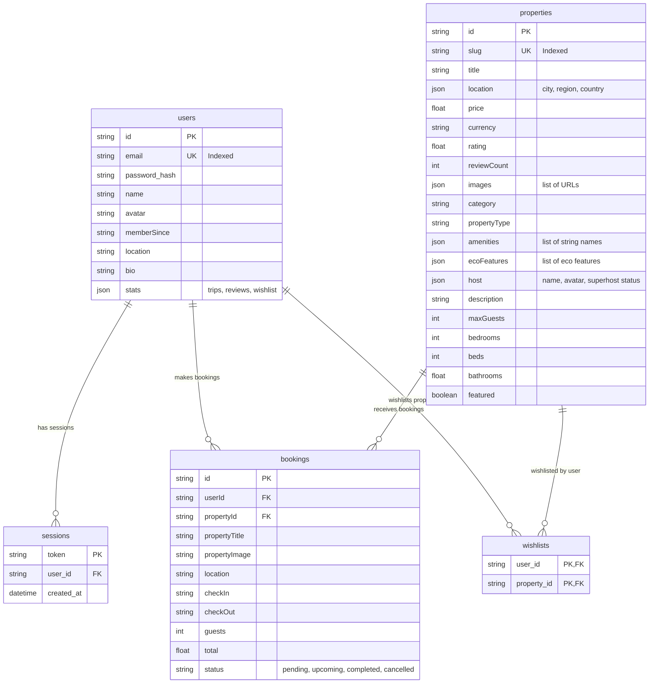

# EcoStay Database Schema Diagram

This document contains the Entity Relationship (ER) diagram and field specifications for the EcoStay PostgreSQL database.

## 1. Entity Relationship Diagram

## 2. Table Specifications

### Users Table (`users`)
- Stores user profile metadata, encrypted authentication tokens, and trip counts.
- Relates to sessions (`sessions` table) and bookings (`bookings` table).

### Properties Table (`properties`)
- Stores details of all eco homestays located across India.
- Employs JSON/JSONB fields for flexibility with images, host metadata, locations, and amenities.

### Bookings Table (`bookings`)
- Tracks booking reservations, guest counts, check-in/out dates, and totals.
- Status states: `pending` (upon Razorpay order registration), `upcoming` (successful verification), and `cancelled`.

### Sessions Table (`sessions`)
- Persists active login session keys.

### Wishlist Association Table (`wishlists`)
- Association junction mapping saved properties to user IDs.
